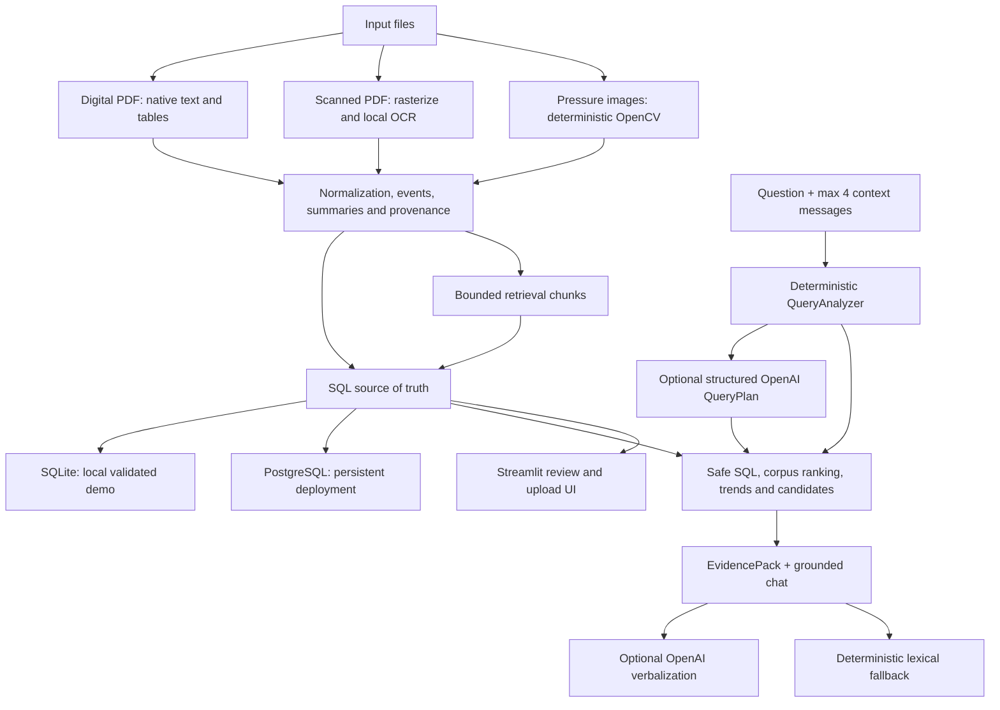

# Architecture

## Boundaries

- Configuration is resolved once. The final database URL is passed explicitly to migration, engine, session, analytics, chat, ingestion, and UI functions. Engine caching is keyed by that URL.
- The shipped SQLite database is validated before and after a consistent backup-API snapshot. The snapshot is flushed, content-addressed, atomically promoted, and never depends on WAL/SHM files.
- PostgreSQL is the durable record store for deployment uploads. The versioned seed command is explicit, idempotent, and refuses non-empty targets.
- `retrieval_chunks` is a maintainable projection, not a second source of truth. Processing replaces chunks for one content-addressed document; the backfill deletes/rebuilds the same document keys idempotently. A corpus fingerprint invalidates the cached TF-IDF index after a successful upload or backfill.
- Query analysis is deterministic first. Unclear questions may receive one bounded structured-output call that returns slots and retrieval terms, never SQL. A registry dispatches trusted summary, report, operation, aggregation, failure, plot, and mapping handlers; everything else uses two-stage corpus retrieval.
- The evidence pack deduplicates source records and limits excerpt count, excerpt length, total characters, and rows before optional OpenAI verbalization. Conversation history resolves references only and is never included as factual evidence.
- New upload assets always retain hash/filename/media type/size/storage status. Raw bytes are metadata-only by default; an explicit bounded database backend can retain small demo assets. Missing temporary paths are never represented as durable storage.
- Native PDF parsing is retained for the 1,000 digital DDRs. Scanned documents use a small OCR backend abstraction with page-level method and confidence.
- Plot processing remains deterministic. Optional image description cannot override stored points, units, citations, or mapping boundaries.
- Chat always retrieves deterministic facts first. After optional query analysis, at most one model call verbalizes those facts, after which numeric, citation, unit, and mapping checks may reject the generated text.

## Before and after

Before this retrieval hardening, chat used a long conditional chain and sent unknown intents to an `ILIKE` search over `ReportSection.text`; query-analysis schema/provider arguments were unused, the first raw section became the answer, and follow-ups lost their context. The final flow uses typed query plans, a handler registry, seven-source bounded chunks, word/character TF-IDF ranking with domain expansion, two-stage fallback, evidence-pack synthesis, and citation/numeric validation. Existing OCR, deterministic CV, database, analytics, safety, and eight-page UI boundaries remain intact.
