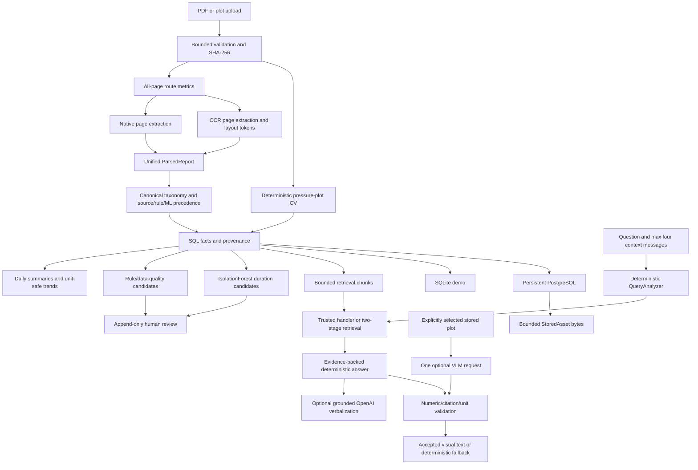

# Architecture

## Processing boundaries

- `streamlit_app.py` resolves one `Settings` object, prepares/migrates exactly one database URL, chooses a provider, displays secret-safe build identity, and dispatches one UI page.
- `ingestion.router.classify_pdf()` inspects every PDF page with selectable-character, printable-ratio, image-count, and image-coverage metrics. All native pages produce `DIGITAL_PDF`, all OCR pages produce `SCANNED_PDF`, and a mixture produces `HYBRID_PDF`.
- `pdf.document.parse_document_pdf()` is the unified orchestration boundary. Native and OCR results are merged in page order into one `ParsedReport`; `_persist_report()` remains the SQL boundary.
- OCR tokens are immutable and include confidence, bounding box, block, paragraph, line, and page. `ocr_tables.py` reconstructs only project-specific DDR structures.
- Ingestion never loads an ML model per row. Service-level enrichment uses a cached, project-controlled activity artifact whose SHA-256 must match metadata.

## ML and analytics boundaries

- Raw activity labels remain source evidence. Canonical normalization records method, confidence, matched alias, and model version without rewriting raw fields.
- Existing valid labels use `source_rule`. ML is a shadow evaluation model for existing rows and a fallback for future missing/noisy labels. Low-confidence predictions become `unknown`.
- IsolationForest uses duration only within sufficiently supported canonical activity groups. A robust z-score threshold and fixed random state gate candidates. It is not trained on `state=fail` or reviewer decisions.
- Rule/data-quality/plot candidates remain intact. ML candidates have `detector_type="ml"`, a model version, and a stable candidate key.
- Anomaly review is append-only. The current state is derived from review history; unreviewed candidates are never described as confirmed.
- Parameter trends collapse duplicate dates by median, require one known compatible unit, exclude invalid/data-quality rows, expose included/excluded counts, and retain Theil-Sen plus Spearman as descriptive evidence only.

## Chat and VLM boundaries

- Query analysis is deterministic first. An optional structured OpenAI query-plan call returns slots, never SQL.
- Trusted handlers own summary, report, activity, failure, anomaly-candidate, plot, trend, and mapping queries. Everything else uses bounded word/character TF-IDF retrieval.
- History may resolve a reference but is never evidence. Evidence packs cap excerpts, rows, and characters.
- Optional generated wording is rejected if it invents a number, unit, citation, mapping, threshold, confirmed anomaly, cause, or recommendation.
- Only a user-selected stored plot image can enter `describe_image()`. The secure loader prefers hash/size/MIME-validated database bytes, otherwise an allowlisted project asset path. At most one visual request is made per selected-plot question.

## Persistence and deployment identity

- Engine caching is keyed by the full resolved URL and uses `pool_pre_ping`; session failures roll back.
- The committed SQLite demo is content-addressed and validated before/after its Cloud runtime copy. It uses `journal_mode=delete` and needs no WAL/SHM companion.
- PostgreSQL seeding is explicit, versioned, idempotent, sequence-repairing, and refuses a non-empty target.
- Accepted production uploads must use the bounded database asset backend. Oversized assets are rejected before extraction so the app never calls a non-durable file persistent.
- Stored bytes are verified on write and read against byte size, SHA-256, PDF signature, or decoded-image validity as applicable.
- Build identity exposes package/parser/schema/seed/model/provider modes and a sanitized short SHA. Database URLs, credentials, and internal paths are never rendered.

## Before and after

Before the final pass, routing was document-level, scanned PDFs stored mostly free text, activity labels were fragmented, anomalies were rule-only and unreviewed, visual description was not wired to Chat, accepted upload bytes defaulted to metadata-only, and deployment identity was not visible.

After the pass, the same architecture has page-aware native/OCR orchestration, OCR layout extraction, canonical source/rule/ML classification, separately identifiable ML candidates, append-only review, selected-image grounded VLM fallback, bounded persistent database assets, fixed evaluations, and a secret-safe runtime identity panel. No vector database, FastAPI service, queue, or external model server was added.
