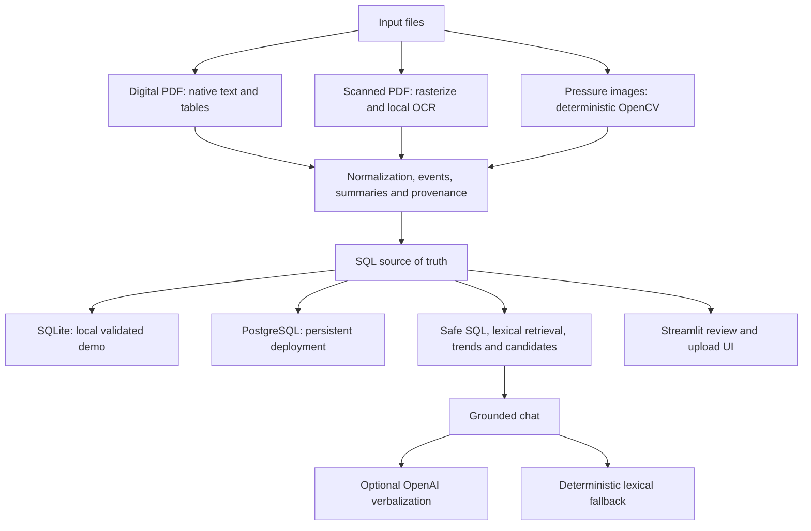

# Architecture

## Boundaries

- Configuration is resolved once. The final database URL is passed explicitly to migration, engine, session, analytics, chat, ingestion, and UI functions. Engine caching is keyed by that URL.
- The shipped SQLite database is validated before and after a consistent backup-API snapshot. The snapshot is flushed, content-addressed, atomically promoted, and never depends on WAL/SHM files.
- PostgreSQL is the durable record store for deployment uploads. The versioned seed command is explicit, idempotent, and refuses non-empty targets.
- Native PDF parsing is retained for the 1,000 digital DDRs. Scanned documents use a small OCR backend abstraction with page-level method and confidence.
- Plot processing remains deterministic. Optional image description cannot override stored points, units, citations, or mapping boundaries.
- Chat always retrieves deterministic facts first. At most one model call verbalizes those facts, after which numeric, citation, unit, and mapping checks may reject the generated text.

## Before and after

Previously, the app mixed a Streamlit-resolved URL with lower-layer global settings, forced SQLite WAL, copied a database without a content identity, detected but rejected scanned PDFs, and carried an Ollama-only semantic path. The final design has one explicit database identity, validated atomic SQLite fallback, PostgreSQL persistence support, working OCR, deterministic retrieval, optional OpenAI verbalization, and a compact page-based Streamlit UI.
